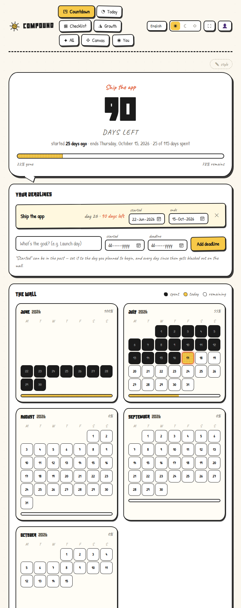
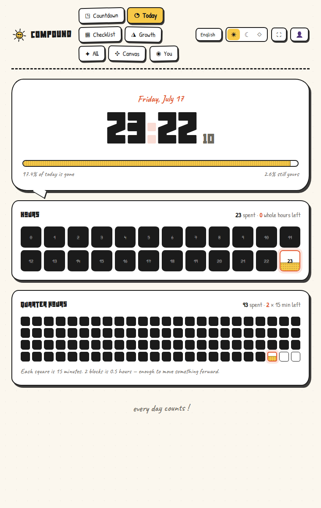
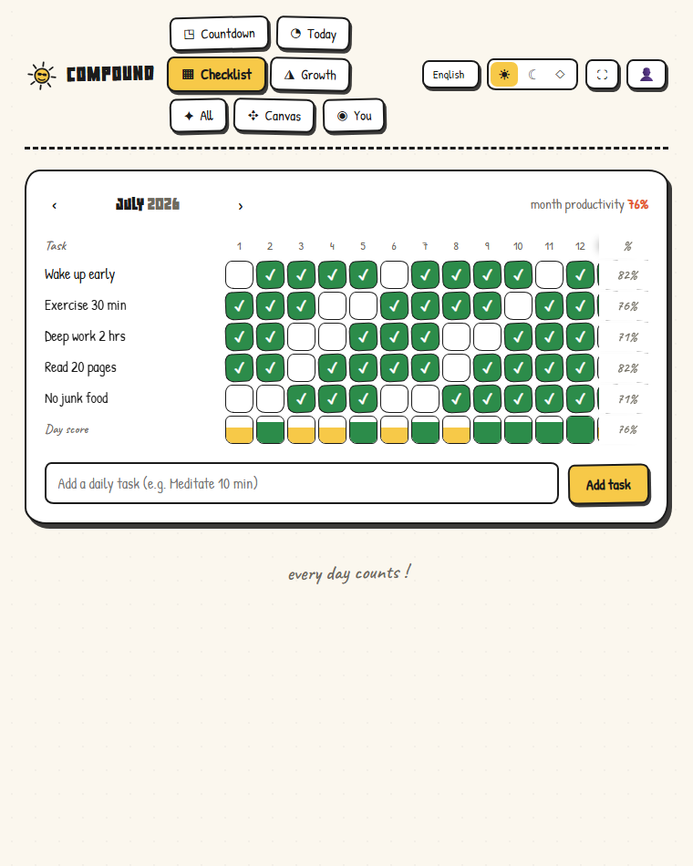
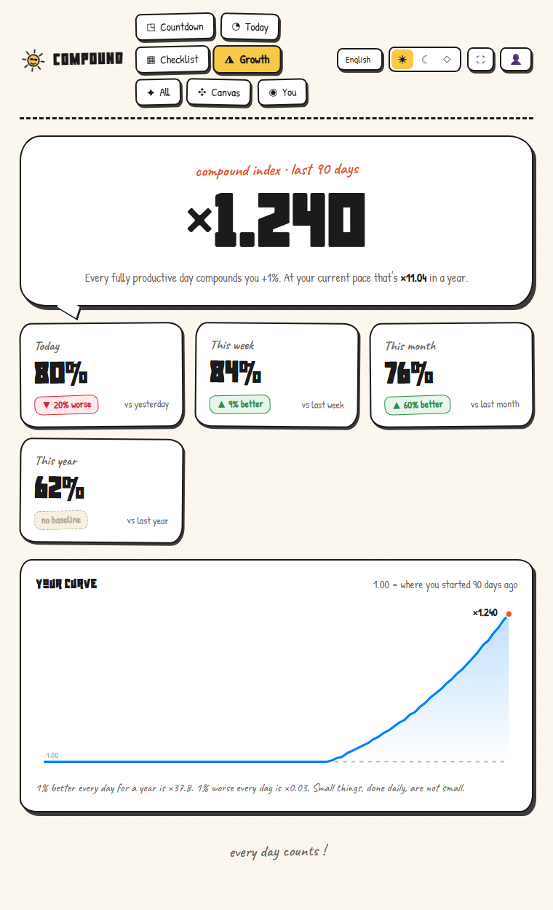
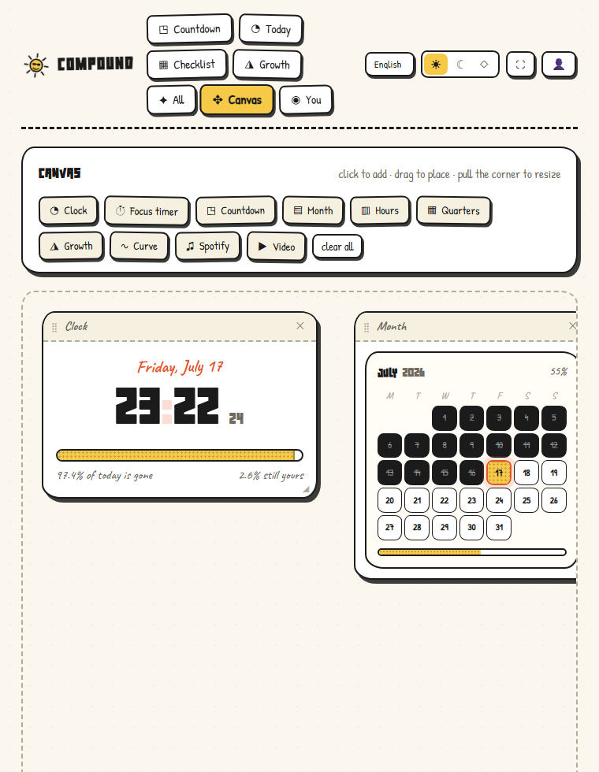
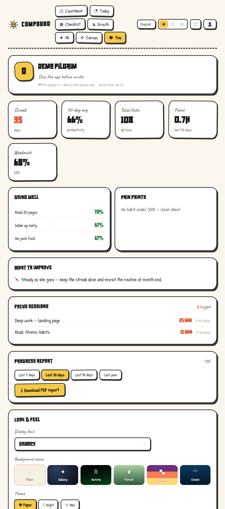
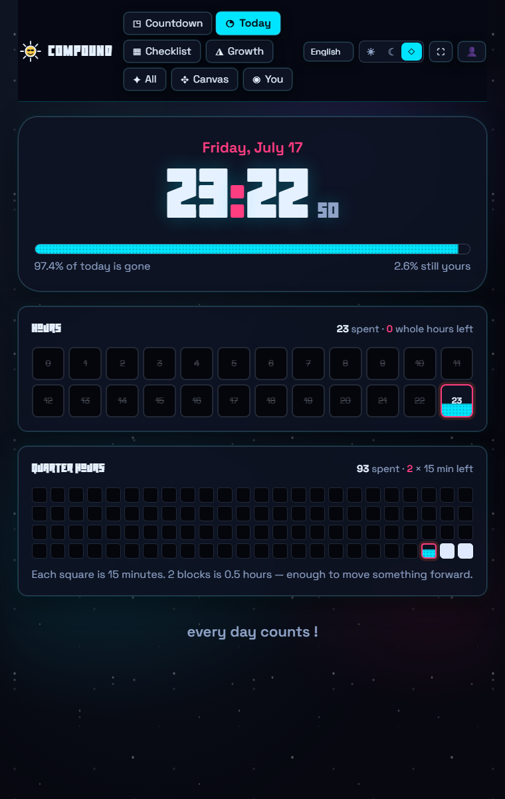
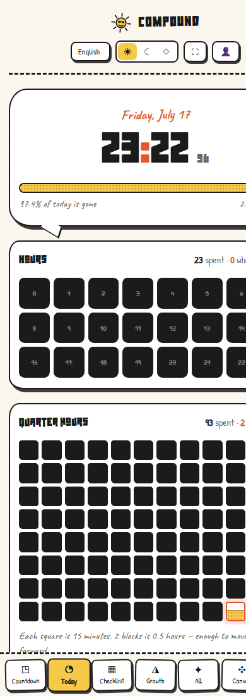

<div align="center">


# C O M P O U N D

**A motivational countdown timer · daily checklist matrix · compounding growth tracker**

*Days spent turn black. Days left stay white. Sand fills the box you're living in right now —
and your progress follows you to every device, live.*

<br/>

### 🌐 [**Use it now → productive-time-track.netlify.app**](https://productive-time-track.netlify.app/)

[](https://productive-time-track.netlify.app/)
[](https://github.com/smafnan/Motivational-Time-Tracker/releases/latest)


<br/>



</div>

---

## Get it

| Platform | How |
|---|---|
| **Web** | [productive-time-track.netlify.app](https://productive-time-track.netlify.app/) — nothing to install |
| **Windows** | [Download the installer](https://github.com/smafnan/Motivational-Time-Tracker/releases/latest) (unsigned — SmartScreen will ask "More info → Run anyway") |
| **macOS** | [Download the .dmg](https://github.com/smafnan/Motivational-Time-Tracker/releases/latest) (Apple-silicon build; unsigned — right-click → Open the first time) |
| **Android** | `npx cap open android` → Run ▶ in Android Studio (project included) |
| **iOS** | `npx cap open ios` on a Mac → Run ▶ in Xcode (project included) |
| **PWA** | Open the web app on your phone → *Add to Home Screen* |

One account, every platform: **log in anywhere and your streaks, checklists, deadlines and
canvas follow you — live.**

---

## The idea

> 1% better every day for a year is **×37.8**. 1% worse every day is **×0.03**.
> Small things, done daily, are not small.

Compound makes time *visible* so you feel it passing, makes your routine *measurable* so you
can watch it compound, and keeps the whole record safe in your account.

## ⏳ Countdown — "The Wall"

Add any number of goals, each with an editable title, an editable **start date** (set it in
the past — *"how many days ago did I plan to start?"*) and a deadline; date fields open a
calendar on click. You get a giant days-left number, a sand progress tube, and **The Wall**:
real calendar pages where every spent day is blacked out, every remaining day stays white,
today's box fills with sand as the day passes, and each month shows its own % spent.

## ◔ Today — hours & quarter-hours

<div align="center"></div>

A live clock with % of the day gone, a 24-box hour grid and a 96-box **15-minute grid**. The
box you're inside right now fills with sand in real time — hover any box and a tooltip tells
you exactly how much of it is filled and how much remains.

## ▦ Checklist — the habit matrix

<div align="center"></div>

Days 1–31 across the top, your daily tasks down the side — tap to tick, click a task name to
**rename it inline**. Per-day score bars, a per-task **month % pinned to the right edge**
(always visible while the sheet scrolls), and overall month productivity. Future days are
locked so the record stays honest.

## ◮ Growth — the compounding engine

<div align="center"></div>

Today vs yesterday, this week vs last, this month vs last, this year vs last — each as
*"% better / worse"*. Every fully productive day multiplies your **compound index** by 1.01,
charted over 90 days with a *"×N in a year at this pace"* projection. An **All** tab shows
every calculation together on one page.

## ✥ Canvas — build the screen you want to stare at

<div align="center"></div>

A free-form dashboard: drop **clock, focus timer, countdown, month calendar, hour grid,
quarter grid, growth cards, the curve, a Spotify player, or a YouTube/local video** anywhere
on the board. Drag to place, pull the corner to **resize in both directions**, stack as many
as you like. The **focus (pomodoro) timer takes a task name** and logs every completed block
to your history. Spotify shows real album art and playback from any pasted link; both media
widgets are optional.

## ◉ You — profile, insights & PDF reports

<div align="center"></div>

An editable profile (name, goal) with headline stats — **streak, 30-day average, total
ticks, focus hours, weekend-vs-weekday** — plus *Going well*, *Pain points*, data-driven
*What to improve* suggestions, and your focus-session history. Export a **designed PDF
progress report** for the last 7 / 30 / 90 / 365 days: stat tiles, daily-rhythm bars, habit
bars and the compound curve, drawn on-device.

## 🎨 Make it yours

<div align="center"></div>

- **Three themes** — hand-drawn Paper, chalkboard Night, and the neon **Neo** above
- **Six animated backgrounds** — galaxy (shooting stars), aurora, forest (fireflies at
  night), pixel sunset, ocean, or plain
- **A 430-font picker** (7 curated + a 423-font library) in a searchable dropdown where
  every entry previews itself; the chosen font takes over the whole app
- **Six languages** — English, العربية (full RTL), Français, Deutsch, Español, हिन्दी —
  switched from the top bar
- A discreet **✎ style** menu right on the home page; deep-link any look with
  `?theme=neo&bg=galaxy`

## ☁️ Accounts, live sync & security

- **Plain login** — email + password, magic link ("email me a login link"), password reset,
  or **Continue with GitHub**
- **Live cross-device sync** — realtime updates plus refresh-on-focus and a 30-second
  fallback. Sync **merges instead of overwriting**: each section and each checklist day
  carries its own edit-time, so switching devices can never reset or lose progress — a tick
  made anywhere survives everywhere
- **Account page** — edit name, phone, email (confirmation flow) and password
- **Security center** — TOTP **two-factor** (scan a QR in any authenticator app), a
  **devices & sessions list** (platform, last active, forget a device), and **log out
  everywhere**
- **Account deletion** built in; every table is locked with row-level security so only you
  can read your data

<div align="center"></div>

## 🧮 The math, honestly

- **Day score** = tasks completed ÷ tasks that existed that day.
- **Compound index** = start at 1.0; each day multiply by `1 + score/100`.
- **"% better"** = `(current − previous) / previous`; weeks start Monday.
- Data lives locally first (works fully offline) and syncs to your account when online.

## 🚀 Run it yourself

```bash
git clone https://github.com/smafnan/Motivational-Time-Tracker.git
cd Motivational-Time-Tracker
npm install
npm run dev          # http://localhost:5173
npm run build        # static site in dist/ — deployable anywhere (this repo → Netlify)
```

Demo mode with generated data: append `?demo`. Deep-link tabs with `?tab=checklist`,
looks with `?theme=night&bg=forest`.

**Desktop:** `npm run dist:win` → `release/Compound-Setup-<version>.exe` (mac/linux scripts
included; macOS builds require a Mac — or use the *Desktop builds* GitHub Action).
**Mobile:** `npm run build && npx cap sync`, then `npx cap open android` / `npx cap open ios`.

## 🛠 Tech

Vite · React 18 · TypeScript · hand-rolled CSS · Supabase (auth, Postgres + RLS, realtime)
· Capacitor 8 (Android/iOS) · Electron (desktop) · jsPDF (on-device reports) · six-language
i18n with RTL. Deployed on Netlify.

## License

[MIT](LICENSE) — do whatever compounds you.

<div align="center"><br/><em>every day counts !</em></div>
