<div align="center">


# C O M P O U N D

**A motivational countdown timer · daily checklist matrix · compounding growth tracker**

*Days spent turn black. Days left stay white. Sand fills the box you're living in right now —
and your progress follows you to every device, live.*

<br/>

### 🌐 [**Use it now → compoundtracker.netlify.app**](https://compoundtracker.netlify.app/)

[](https://compoundtracker.netlify.app/)
[](https://github.com/smafnan/compound/releases/latest)
[](https://github.com/smafnan/compound/releases/latest)
[](https://github.com/smafnan/compound/releases/latest)
[](https://github.com/smafnan/compound/releases/latest)


<br/>

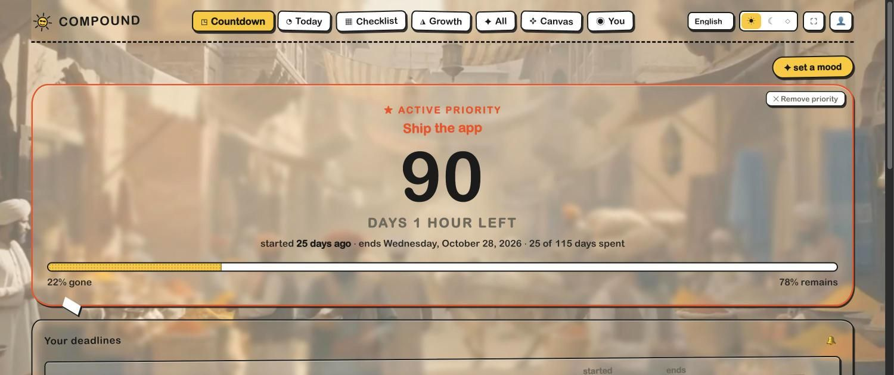

</div>

---

## Get it

| Platform | How |
|---|---|
| **Web** | [compoundtracker.netlify.app](https://compoundtracker.netlify.app/) — nothing to install |
| **Windows** | [Download the installer](https://github.com/smafnan/compound/releases/latest) (unsigned — SmartScreen will ask "More info → Run anyway") |
| **macOS** | [Download the .dmg](https://github.com/smafnan/compound/releases/latest) (Apple-silicon build; unsigned — [one extra step on first launch](#macos-first-launch)) |
| **Linux** | [Download the AppImage](https://github.com/smafnan/compound/releases/latest) (`chmod +x` then run) |
| **Android** | [Download the APK](https://github.com/smafnan/compound/releases/latest) (`Compound-android.apk`; debug-signed — allow "Install unknown apps" when asked) |
| **iOS** | `npx cap open ios` on a Mac → Run ▶ in Xcode (project included) — or install the PWA below |
| **PWA** | Open the web app on your phone → **Add to Home Screen** (Android Chrome: ⋮ menu · iPhone/iPad Safari: Share → Add to Home Screen). Installs like a native app, has its own icon + splash screen, and works offline |

One account, every platform: **log in anywhere and your streaks, checklists, deadlines and
canvas follow you — live.** And once you have it, **it tells you when there's a new
version** — see [Updates](#-updates--every-copy-keeps-itself-current) below.

#### macOS first launch

The Mac build is signed, but not *notarized* — that needs a paid Apple Developer certificate.
So the first time you open it, macOS blocks it with **"Apple could not verify Compound is free
of malware…"**. Getting past it takes four clicks, once:

1. Drag **Compound** into **Applications** — don't run it from the mounted disk image
2. Double-click it, let the warning appear, click **Done**
3. Open **System Settings → Privacy & Security** and scroll down to **Security**
4. Next to *"Compound was blocked to protect your Mac"*, click **Open Anyway** and authenticate

**Open Anyway** only appears *after* a blocked attempt and it expires after about an hour, so
step 2 is not optional. Prefer the terminal? `xattr -dr com.apple.quarantine
/Applications/Compound.app` clears the download flag and it opens normally.

> On macOS 14 and earlier this was a right-click → **Open**. Apple removed that bypass in
> macOS 15 Sequoia; the override now lives in System Settings.

---

## The idea

> 1% better every day for a year is **×37.8**. 1% worse every day is **×0.03**.
> Small things, done daily, are not small.

Compound makes time *visible* so you feel it passing, makes your routine *measurable* so you
can watch it compound, and keeps the whole record safe in your account.

## ⏳ Countdown — "The Wall"

Add any number of goals, each with an editable title, an editable **start date** (set it in
the past — *"how many days ago did I plan to start?"*) and a deadline; date fields open a
calendar on click. The countdown is **live and smart** — it shows the two units that matter
(`8 days 5 hours` → `23 hours 15 minutes` → `58 minutes 12 seconds` → `9 seconds`) and ticks
every second. **Drag the ⠿ handle to reorder** deadlines (the order syncs to your account),
and **star one as your Active Priority** to pin it in its own section at the top.
You get a giant time-left number, a sand progress tube, and **The Wall**:
real calendar pages where every spent day is blacked out, every remaining day stays white,
today's box fills with sand as the day passes, and each month shows its own % spent.

### ⏱ Or count down a *length of time*

<div align="center">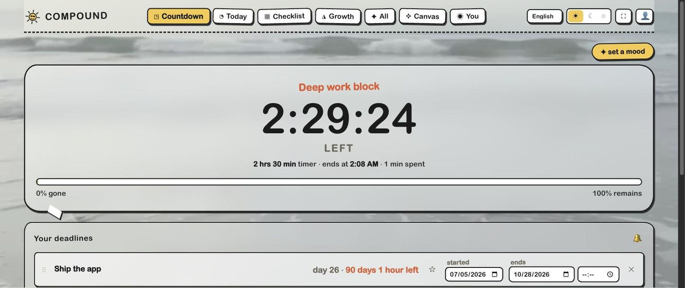</div>

Not everything is a date. Flip the add form to **Timer** and count down *3 hours* as easily
as *to Nov 3rd* — hours + minutes, or one tap on `25m · 1h · 2h · 4h · 8h`. You get a live
`H:MM:SS` face, and each row carries **−/+ 15 min** and a **restart**. Timers store an
absolute end instant, so they survive a reload, keep running while the app is closed, and
still chime when they hit zero.

## ◔ Today — hours & quarter-hours

<div align="center">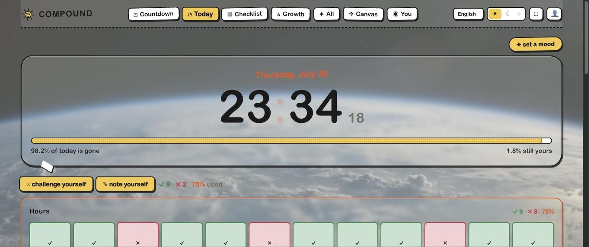</div>

A live clock with % of the day gone, a 24-box hour grid and a 96-box **15-minute grid**. The
box you're inside right now fills with sand in real time — hover any box and a tooltip tells
you exactly how much of it is filled and how much remains.

### ⚔ Challenge yourself · ✎ Note yourself

<div align="center">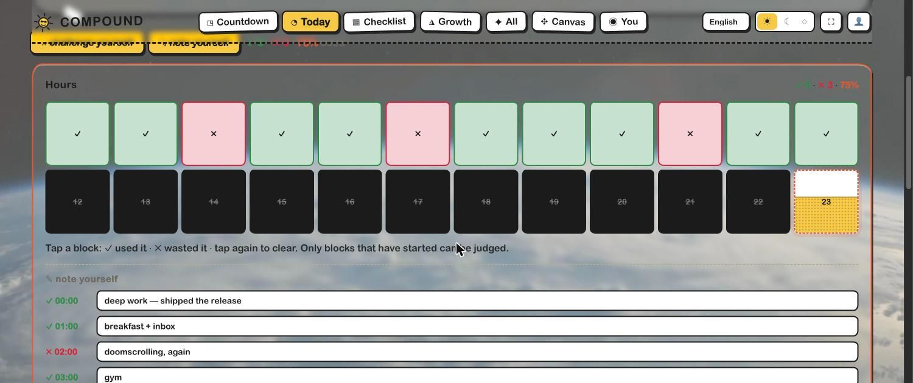</div>

Two independent switches turn the grids into a record of how you actually spent the day:

- **Challenge yourself** — one tap cycles a block **none → ✓ used it → ✗ wasted it**. Panel
  heads keep a running score (hits, misses, and the share of judged blocks you used). Only
  blocks that have already *started* can be judged, so the record stays honest.
- **Note yourself** — adds a line under each grid for **what you actually did** in that block.
  A cross with *"doomscrolling, again"* beside it is worth more than the cross alone.

Neither switch drags the other on, and both verdicts and notes sync across your devices on
the same per-day merge rules as your checklist ticks.

## ▦ Checklist — the habit matrix

<div align="center">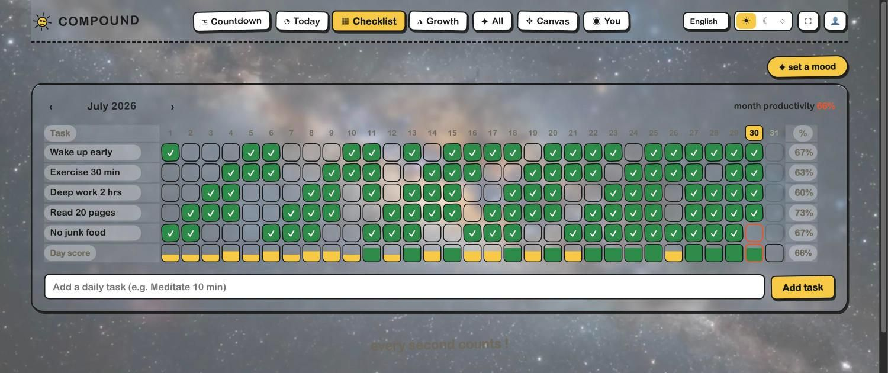</div>

Days 1–31 across the top, your daily tasks down the side — tap to tick, click a task name to
**rename it inline**. Per-day score bars, a per-task **month % pinned to the right edge**
(always visible while the sheet scrolls), and overall month productivity. Future days are
locked so the record stays honest.

## ◮ Growth — the compounding engine

<div align="center">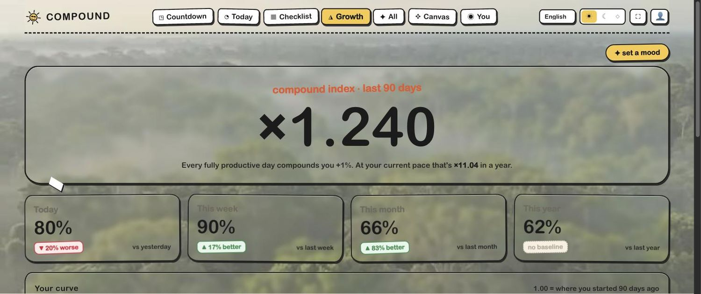</div>

Today vs yesterday, this week vs last, this month vs last, this year vs last — each as
*"% better / worse"*. Every fully productive day multiplies your **compound index** by 1.01,
charted over 90 days with a *"×N in a year at this pace"* projection. An **All** tab shows
every calculation together on one page.

## ✥ Canvas — build the screen you want to stare at

<div align="center">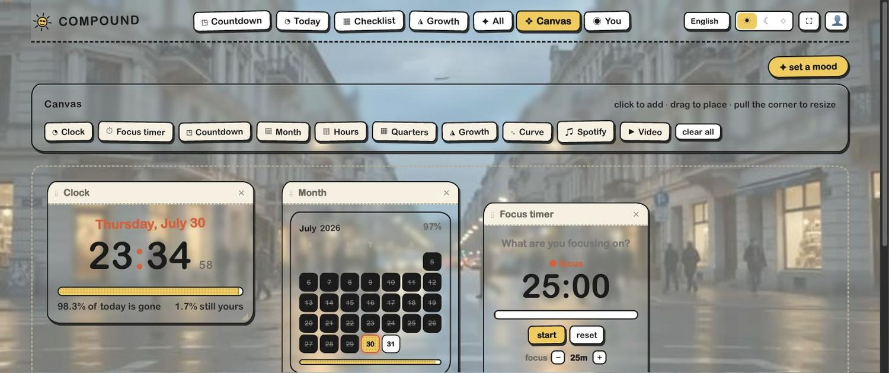</div>

A free-form dashboard: drop **clock, focus timer, countdown, month calendar, hour grid,
quarter grid, growth cards, the curve, a Spotify player, or a YouTube/local video** anywhere
on the board. Drag to place, pull the corner to **resize in both directions**, stack as many
as you like. The **focus (pomodoro) timer takes a task name** and logs every completed block
to your history, then rolls into a break on its own — or hit **☕ break** to start one
whenever you want, and **● focus** to get back to work. Spotify shows real album art and
playback from any pasted link; both media widgets are optional.

Hit **⛶ full screen** and the canvas takes the whole display on its own — no top bar, no
tabs, no footer, just your board (and the video scene behind it). The widget tray tucks
into a corner button, and **Esc** brings the rest of the app back.

## ◉ You — profile, insights & PDF reports

<div align="center">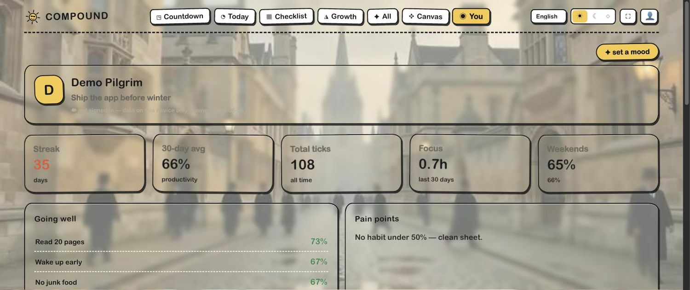</div>

An editable profile (name, goal) with headline stats — **streak, 30-day average, total
ticks, focus hours, weekend-vs-weekday** — plus *Going well*, *Pain points*, data-driven
*What to improve* suggestions, and your focus-session history. Export a **designed PDF
progress report** for the last 7 / 30 / 90 / 365 days: stat tiles, daily-rhythm bars, habit
bars and the compound curve, drawn on-device.

## 🎨 Make it yours

<div align="center">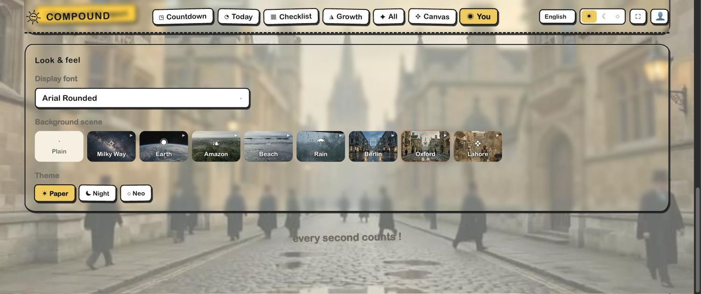</div>

### 🎬 Eight live video scenes

Set the whole app against a **looping video**: the **Milky Way**, **Earth** from orbit, the
**Amazon** canopy, a **Beach**, **Rain** on a window, **Berlin** at blue hour, Victorian
**Oxford**, or a Mughal-era **Lahore** bazaar. Pick one by sight — every card shows its own
still.

They're built to be lived with, not just demoed:

- **silent and seamless** — the audio track is stripped and the tail is cross-dissolved into
  the head, so there's no jump on loop
- **paused whenever the app isn't on screen**, so a background tab costs you nothing
- **reduced-motion aware** — the OS setting swaps the video for its still
- **~1.3 MB each** at 720p, and cached by the service worker after first play, so a scene
  you've seen works offline
- graceful all the way down: poster → still tint → plain, so the app never sits on a blank
  backdrop

[How to add your own →](docs/video-scenes.md)

### 🫧 Frosted glass

<div align="center">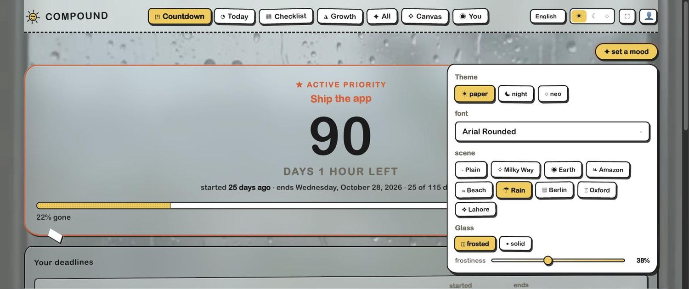</div>

Over a scene the whole interface turns to **glass** so the footage reads through it, while
every text colour stays fully opaque. A **frostiness slider** takes it from barely-there to
nearly solid — one control drives panel tint, blur radius, the bars and the checklist
surfaces together, so nothing goes out of proportion. Prefer it plain? Flip Glass to
**solid**.

### And the rest

<div align="center">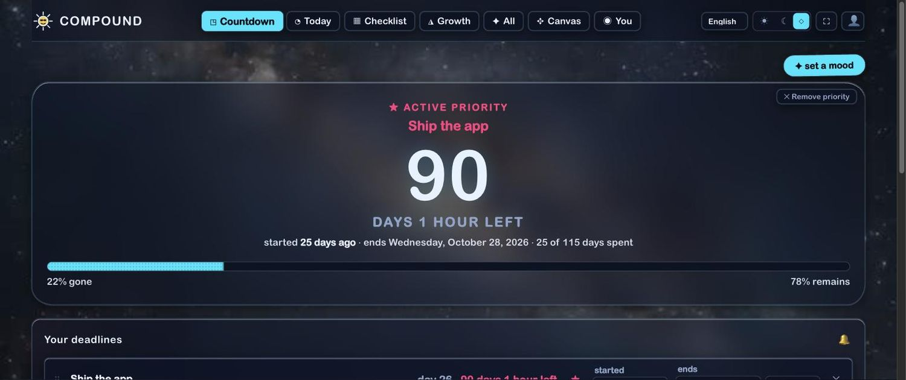</div>

- **Three themes** — hand-drawn Paper, chalkboard Night, and the neon **Neo** above
- **A 430-font picker** (curated + a 423-font library) in a searchable dropdown where every
  entry previews itself; **Arial Rounded** is the default and the chosen font takes over the
  whole app
- **Six languages** — English, العربية (full RTL), Français, Deutsch, Español, हिन्दी —
  switched from the top bar
- **✦ set a mood** sits on *every* section, and any look is deep-linkable:
  `?theme=neo&bg=vid-milkyway`

### 📱 Built for the phone too

<div align="center">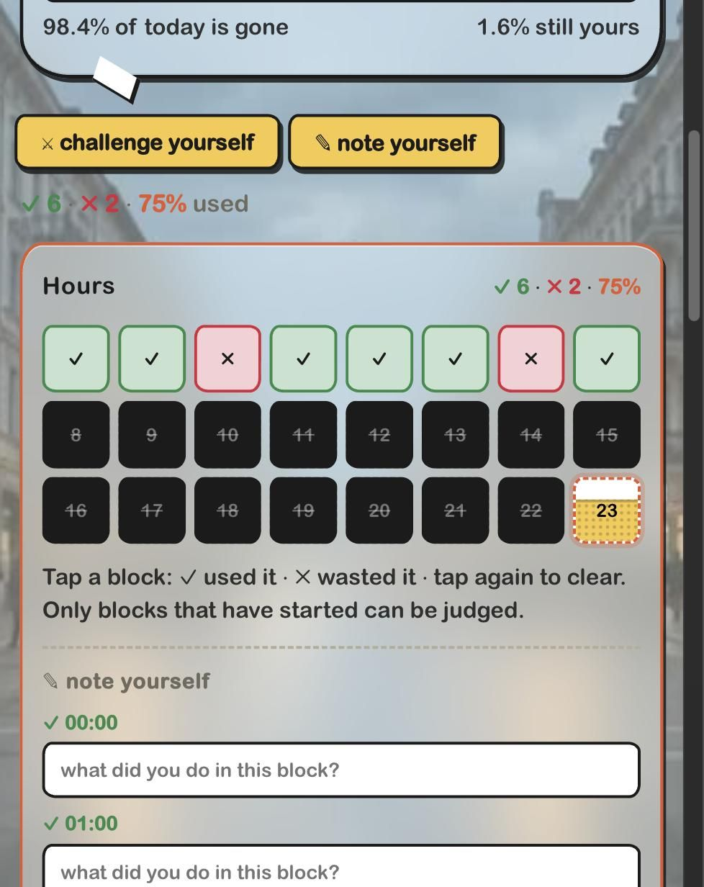</div>

Every feature above is checked at phone widths: the tab bar moves to the bottom and frosts
itself, quarter-hour blocks widen into proper touch targets while you're judging them, note
fields go full width, and nothing ever scrolls sideways.

## ☁️ Accounts, live sync & security

- **Plain login** — email + password, magic link ("email me a login link"), password reset,
  or **Continue with GitHub**
- **Live cross-device sync** — realtime updates plus refresh-on-focus and a 30-second
  fallback. Sync **merges instead of overwriting**: each section and each checklist day
  carries its own edit-time, so switching devices can never reset or lose progress — a tick
  made anywhere survives everywhere
- **Account page** — edit name, phone, email (confirmation flow) and password
- **Security center** — TOTP **two-factor** (scan a QR in any authenticator app), a
  **devices & sessions list** (platform, last active, forget a device), and **log out
  everywhere**
- **Account deletion** built in; every table is locked with row-level security so only you
  can read your data

<div align="center">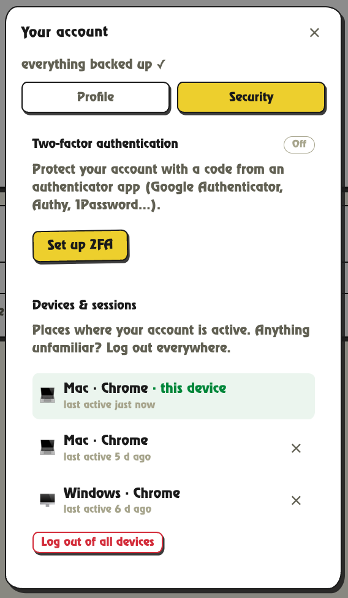</div>

</div>

## 🧮 The math, honestly

- **Day score** = tasks completed ÷ tasks that existed that day.
- **Compound index** = start at 1.0; each day multiply by `1 + score/100`.
- **"% better"** = `(current − previous) / previous`; weeks start Monday.
- Data lives locally first (works fully offline) and syncs to your account when online.

## 🚀 Run it yourself

```bash
git clone https://github.com/smafnan/compound.git
cd compound
npm install
npm run dev          # http://localhost:5173
npm run build        # static site in dist/ — deployable anywhere (this repo → Netlify)
```

Demo mode with generated data: append `?demo`. Deep-link tabs with `?tab=checklist`,
looks with `?theme=night&bg=vid-rain`.

**Desktop:** `npm run dist:win` / `dist:mac` / `dist:linux` → installers in `release/`
(each OS builds its own; or push a `v*` tag and the *Desktop builds* Action produces
Windows `.exe`, macOS `.dmg`/`.zip` and a Linux `.AppImage` and attaches them to the
release, along with the `latest*.yml` files that installed copies read to discover the
update — see [docs/releasing.md](docs/releasing.md)).
**Mobile:** `npm run build && npx cap sync`, then `npx cap open android` / `npx cap open ios`.

### 📱 Build the Android APK locally

Requires JDK 21 and the Android SDK (easiest via [Android Studio](https://developer.android.com/studio)):

```bash
npm ci
npm run build              # web build → dist/
npx cap sync android       # copy dist/ into the Android project
cd android
./gradlew assembleDebug    # → android/app/build/outputs/apk/debug/app-debug.apk
```

Install the APK on a device with `adb install app-debug.apk`, or run it straight from
Android Studio (`npx cap open android` → Run ▶). No local toolchain? The **Android APK**
GitHub Action builds it in the cloud — every `v*` tag attaches `Compound-android.apk` to
the release, and *Actions → Android APK → Run workflow* produces a downloadable artifact.

### 🎬 Adding a video scene

Drop an MP4 in `public/scenes/`, add one line to `VIDEO_SCENES` in `src/Backdrop.tsx`, and
it appears in both scene pickers and as a `?bg=` deep link. `scripts/scene-encode.swift`
re-encodes a clip for you — fixed bitrate, audio stripped, tail cross-dissolved into the
head for a seamless loop — using only AVFoundation, so **no ffmpeg required**. Full guide,
including the bitrate table and how the `scrim` value is derived, in
[docs/video-scenes.md](docs/video-scenes.md).

### ✉️ Supabase email links (self-hosting)

If you point the app at your own Supabase project, set **Auth → URL Configuration**:
*Site URL* = your deployed origin, and add it to *Redirect URLs* (plus
`http://localhost:5173` for dev). Otherwise verification / magic-link emails redirect to
Supabase's default and land on a blank page instead of back in the app.

## 🔄 Updates — every copy keeps itself current

Install it once and it stays current. A few seconds after launch — and every six hours
after that — the app checks whether a newer release exists, and if one does, a small card
appears in the corner with the version, the release notes and one button. Nothing installs
without being asked, and "not now" hides that version for good.

| Where | What happens |
|---|---|
| **Windows · macOS · Linux** | downloads in the background with a progress bar, then restarts into the new version |
| **Web / PWA** | the new build is fetched and parked; one tap swaps it in |
| **Android** | opens the release page for the new APK (a sideloaded app can't replace itself) |

Under the hood: `electron-updater` against GitHub releases on desktop, the service worker
on the web, the releases API on Android — all three normalised into one hook and one card.
Full write-up in [docs/updates.md](docs/updates.md).

## 🛠 Tech

Vite · React 18 · TypeScript · hand-rolled CSS (`backdrop-filter` glass, `color-mix`
theming) · Supabase (auth, Postgres + RLS, realtime) · Capacitor 8 (Android/iOS) · Electron
+ electron-updater (desktop) · jsPDF (on-device reports) · six-language i18n with RTL.
Deployed on Netlify.

No UI framework, no CSS framework, no state library — the whole interface is hand-written.

## License

[MIT](LICENSE) — do whatever compounds you.

<div align="center"><br/><em>every second counts !</em></div>
